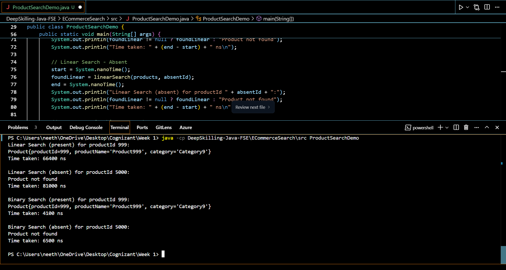

# E-Commerce Platform Search Function

## Overview
This project demonstrates search functionality for an e-commerce platform, focusing on performance comparison between linear search and binary search algorithms using Java.

## Code Explanation

### Product Class
- **Attributes:**
  - `productId`: Unique identifier for the product.
  - `productName`: Name of the product.
  - `category`: Category to which the product belongs.
- **Purpose:** Represents a product in the e-commerce platform.

### Search Algorithms
- **Linear Search:**
  - Iterates through each product in the array.
  - Time Complexity: O(n)
  - Suitable for small or unsorted datasets.
- **Binary Search:**
  - Requires the array to be sorted by `productId`.
  - Repeatedly divides the search interval in half.
  - Time Complexity: O(log n)
  - Much faster for large, sorted datasets.

### Performance Comparison
- The code creates an array of 1000 products.
- It searches for a product that is present (worst-case for linear search) and one that is absent.
- It measures and prints the time taken (in nanoseconds) for both linear and binary search in both scenarios.

### Example Output
The following output was generated by running the program:



- **Linear Search (present):** Takes longer as it may need to scan the entire array.
- **Binary Search (present):** Much faster due to logarithmic time complexity.
- **Absent cases:** Binary search still outperforms linear search.

## How to Run
1. Compile the Java file:
   ```
   javac src/ProductSearchDemo.java
   ```
2. Run the program:
   ```
   java -cp src ProductSearchDemo
   ```
3. You should see output similar to the screenshot above.
