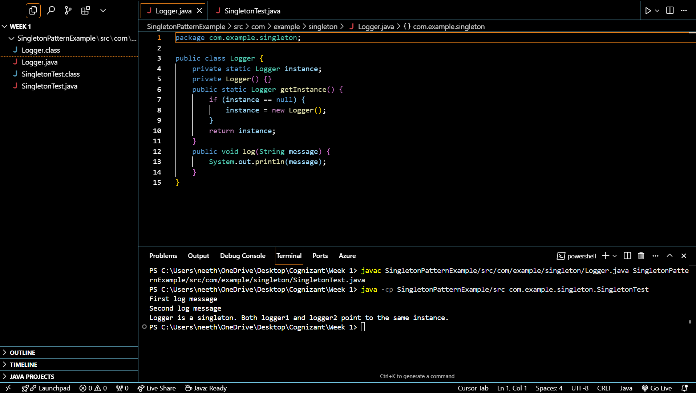

# Singleton Pattern Example in Java

This project demonstrates the implementation of the Singleton design pattern. The goal is to ensure that a class has only one instance and to provide a global point of access to it.

## 1. Project Structure

The project is organized as follows. The `.class` files are generated after compilation.

```
SingletonPatternExample/
└── src/
    └── com/
        └── example/
            └── singleton/
                ├── Logger.java         // The Singleton class
                └── SingletonTest.java  // The test class
```

## 2. How the Code Works

### `Logger.java` (The Singleton Class)

This class is designed to ensure only one instance of it can ever be created.

```java
public class Logger {
    // 1. A private static variable to hold the single instance of the class.
    private static Logger instance;

    // 2. A private constructor. This prevents other classes from creating a new instance.
    private Logger() {}

    // 3. A public static method that provides access to the single instance.
    public static Logger getInstance() {
        if (instance == null) {
            instance = new Logger();
        }
        return instance;
    }

    public void log(String message) {
        System.out.println(message);
    }
}
```

### `SingletonTest.java` (The Test Class)

This class is used to verify that the `Logger` class correctly works as a singleton.

```java
public class SingletonTest {
    public static void main(String[] args) {
        // Get the logger instance twice.
        Logger logger1 = Logger.getInstance();
        Logger logger2 = Logger.getInstance();

        // Use both variables to log messages.
        logger1.log("First log message");
        logger2.log("Second log message");

        // Check if both variables point to the exact same object in memory.
        if (logger1 == logger2) {
            System.out.println("Logger is a singleton. Both logger1 and logger2 point to the same instance.");
        } else {
            System.out.println("Logger is NOT a singleton. They are different instances.");
        }
    }
}
```
The test works because both `logger1` and `logger2` will always hold a reference to the same object, proving the pattern is correctly implemented.

## 3. How to Compile and Run

From your root directory (`C:\...\Week 1`), you can run the project with the following commands:

1.  **Compile the .java files:**
    ```sh
    javac "Engineering concept/Week 1 - Design Patterns/SingletonPatternExample/src/com/example/singleton/Logger.java" "Engineering concept/Week 1 - Design Patterns/SingletonPatternExample/src/com/example/singleton/SingletonTest.java"
    ```
2.  **Run the test class:**
    ```sh
    java -cp "Engineering concept/Week 1 - Design Patterns/SingletonPatternExample/src" com.example.singleton.SingletonTest
    ```

## 4. Output and Verification



```
First log message
Second log message
Logger is a singleton. Both logger1 and logger2 point to the same instance.
``` 
=======
