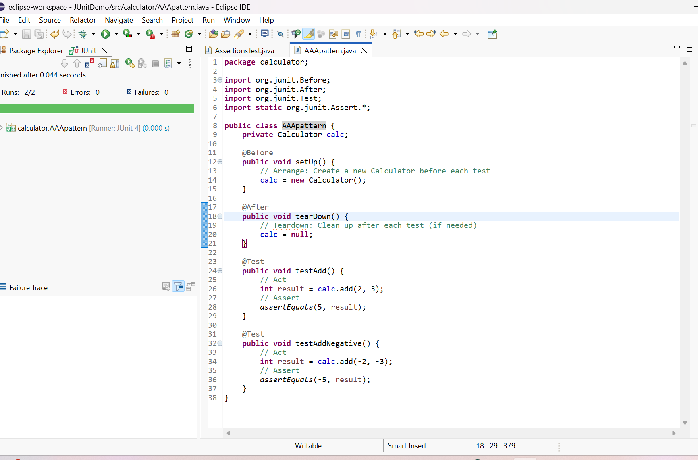

# Arrange-Act-Assert (AAA) Pattern and Test Fixtures in JUnit

## Overview
This folder demonstrates how to organize your JUnit tests using the Arrange-Act-Assert (AAA) pattern and how to use setup and teardown methods with `@Before` and `@After` annotations.

## AAA Pattern
- **Arrange:** Set up test objects and prepare prerequisites for your test.
- **Act:** Perform the action you want to test.
- **Assert:** Verify the result.

## Setup and Teardown
- `@Before`: Method runs before each test to set up test fixtures.
- `@After`: Method runs after each test to clean up.

## Sample Code

**CalculatorAAATest.java**
```java
package calculator;

import org.junit.Before;
import org.junit.After;
import org.junit.Test;
import static org.junit.Assert.*;

public class CalculatorAAATest {
    private Calculator calc;

    @Before
    public void setUp() {
        // Arrange: Create a new Calculator before each test
        calc = new Calculator();
    }

    @After
    public void tearDown() {
        // Teardown: Clean up after each test (if needed)
        calc = null;
    }

    @Test
    public void testAdd() {
        // Act
        int result = calc.add(2, 3);
        // Assert
        assertEquals(5, result);
    }

    @Test
    public void testAddNegative() {
        // Act
        int result = calc.add(-2, -3);
        // Assert
        assertEquals(-5, result);
    }
}
```

## Output Screenshot
Below is the screenshot of the successful JUnit test run (green bar indicates all tests passed):



*Replace `output_screenshot.png` with your actual screenshot file.*

---

This setup confirms the use of the AAA pattern and test fixtures in your Eclipse Java project with JUnit. 