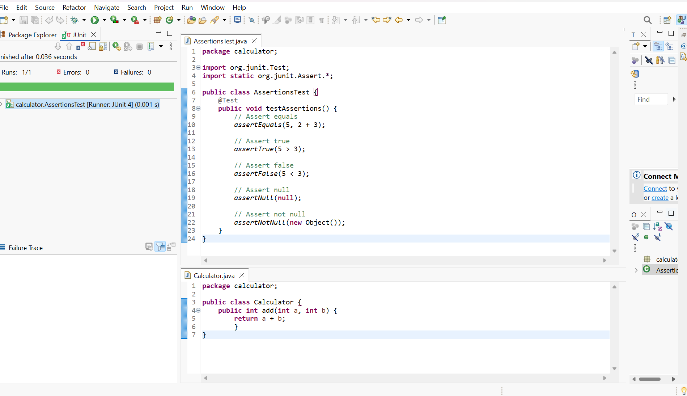

# Assertions in JUnit

## Overview
This folder demonstrates the use of various JUnit assertions in a Java project using Eclipse IDE. It includes a sample `AssertionsTest` class that showcases different assertion methods provided by JUnit.

## Assertions Demonstrated
- `assertEquals(expected, actual)`: Checks if two values are equal.
- `assertTrue(condition)`: Checks if a condition is true.
- `assertFalse(condition)`: Checks if a condition is false.
- `assertNull(object)`: Checks if an object is null.
- `assertNotNull(object)`: Checks if an object is not null.

## Sample Code

**AssertionsTest.java**
```java
package calculator;

import org.junit.Test;
import static org.junit.Assert.*;

public class AssertionsTest {
    @Test
    public void testAssertions() {
        // Assert equals
        assertEquals(5, 2 + 3);

        // Assert true
        assertTrue(5 > 3);

        // Assert false
        assertFalse(5 < 3);

        // Assert null
        assertNull(null);

        // Assert not null
        assertNotNull(new Object());
    }
}
```

## Output Screenshot
Below is the screenshot of the successful JUnit test run (green bar indicates all assertions passed):



*Replace `output_screenshot.png` with your actual screenshot file.*

---

This setup confirms the use of different JUnit assertions in your Eclipse Java project. 