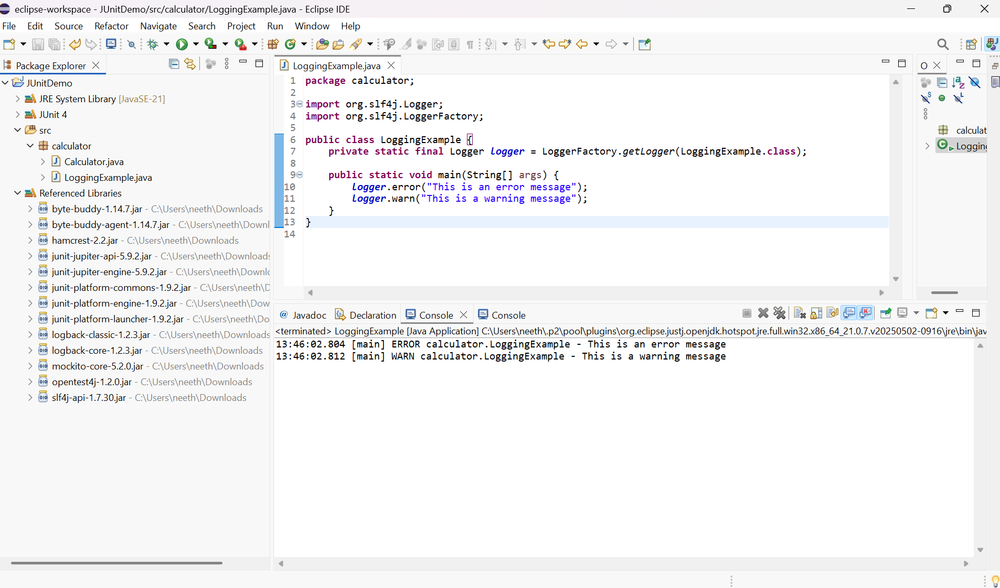

# Logging Error Messages and Warning Levels with SLF4J

## Overview
This project demonstrates how to use SLF4J with Logback to log error and warning messages in a Java application.

## Setup

### If using Maven
Add the following dependencies to your `pom.xml`:
```xml
<dependency>
    <groupId>org.slf4j</groupId>
    <artifactId>slf4j-api</artifactId>
    <version>1.7.30</version>
</dependency>
<dependency>
    <groupId>ch.qos.logback</groupId>
    <artifactId>logback-classic</artifactId>
    <version>1.2.3</version>
</dependency>
```

### If not using Maven
Download and add these JARs to your build path:
- slf4j-api-1.7.30.jar
- logback-classic-1.2.3.jar
- logback-core-1.2.3.jar

## Sample Code

```java
import org.slf4j.Logger;
import org.slf4j.LoggerFactory;

public class LoggingExample {
    private static final Logger logger = LoggerFactory.getLogger(LoggingExample.class);

    public static void main(String[] args) {
        logger.error("This is an error message");
        logger.warn("This is a warning message");
    }
}
```

## Output Screenshot
Below is the screenshot of the console output showing error and warning messages:



---

This setup confirms that SLF4J and Logback are working for logging error and warning messages in your Java application.