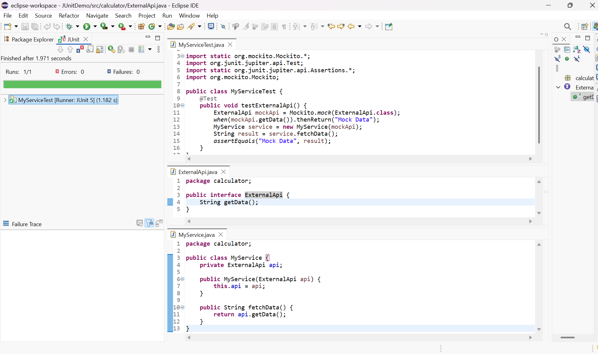

# Mocking and Stubbing with Mockito in Java

## Overview
This folder demonstrates how to use Mockito for mocking and stubbing dependencies in a plain Java project (without Maven or Gradle) using Eclipse. It includes a sample service class, an external API interface, and a JUnit 5 test class that uses Mockito to mock and stub the external API.

## Setup Steps
1. **Download and add the following JARs to your project's build path:**
   - mockito-core-5.2.0.jar
   - junit-jupiter-api-5.9.2.jar
   - junit-jupiter-engine-5.9.2.jar
   - opentest4j-1.2.0.jar
   - hamcrest-2.2.jar
   - byte-buddy-1.14.7.jar
   - byte-buddy-agent-1.14.7.jar
2. **Right-click your project > Build Path > Configure Build Path > Libraries > Add External JARs...**
3. **Add all the downloaded JARs and click Apply and Close.**

## Sample Code

**ExternalApi.java**
```java
package calculator;

public interface ExternalApi {
    String getData();
}
```

**MyService.java**
```java
package calculator;

public class MyService {
    private ExternalApi api;

    public MyService(ExternalApi api) {
        this.api = api;
    }

    public String fetchData() {
        return api.getData();
    }
}
```

**MyServiceTest.java**
```java
package calculator;

import static org.mockito.Mockito.*;
import org.junit.jupiter.api.Test;
import static org.junit.jupiter.api.Assertions.*;
import org.mockito.Mockito;

public class MyServiceTest {
    @Test
    public void testExternalApi() {
        ExternalApi mockApi = Mockito.mock(ExternalApi.class);
        when(mockApi.getData()).thenReturn("Mock Data");
        MyService service = new MyService(mockApi);
        String result = service.fetchData();
        assertEquals("Mock Data", result);
    }
}
```

## Output Screenshot
Below is the screenshot of the successful JUnit test run (green bar indicates the mock and stub worked as expected):



*Replace `output_screenshot.png` with your actual screenshot file.*

---

This setup confirms that Mockito can be used for mocking and stubbing in a plain Java project in Eclipse. 