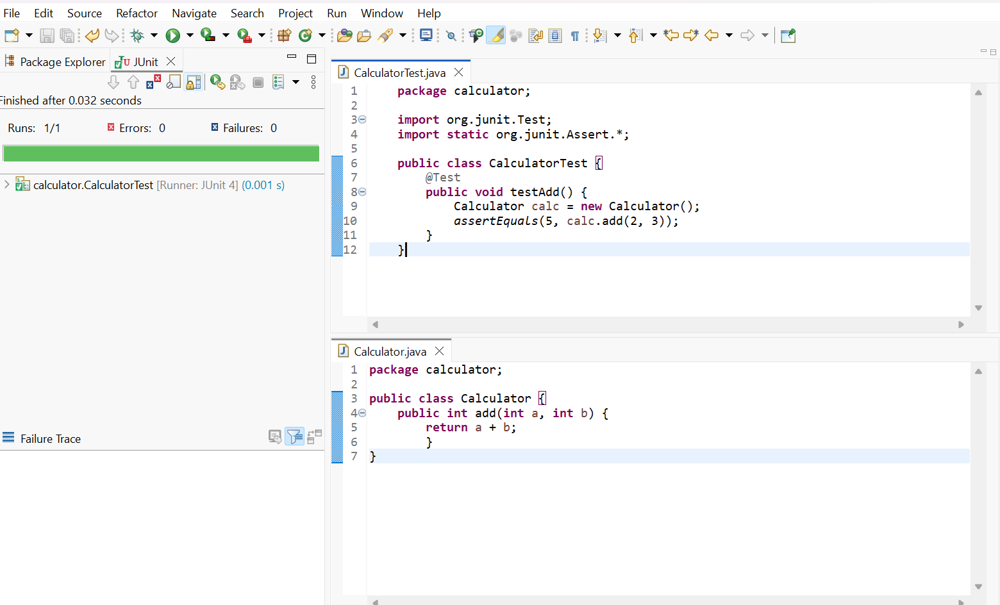

# Setting Up JUnit in Eclipse

## Overview
This folder demonstrates how to set up JUnit in a Java project using Eclipse IDE. It includes a sample `Calculator` class and a corresponding JUnit test class `CalculatorTest`.

## Steps Followed
1. **Created a new Java project** in Eclipse named `JUnitDemo`.
2. **Added JUnit 4 library** to the project via Build Path.
3. **Created a package** named `calculator`.
4. **Created a `Calculator` class** with a simple `add` method.
5. **Created a JUnit test class** `CalculatorTest` to test the `add` method.
6. **Ran the test** and verified the output using the JUnit view in Eclipse.

## Sample Code

**Calculator.java**
```java
package calculator;

public class Calculator {
    public int add(int a, int b) {
        return a + b;
    }
}
```

**CalculatorTest.java**
```java
package calculator;

import org.junit.Test;
import static org.junit.Assert.*;

public class CalculatorTest {
    @Test
    public void testAdd() {
        Calculator calc = new Calculator();
        assertEquals(5, calc.add(2, 3));
    }
}
```

## Output Screenshot
Below is the screenshot of the successful JUnit test run (green bar indicates all tests passed):



*Replace `output_screenshot.png` with your actual screenshot file.*

---

This setup confirms that JUnit is correctly configured and working in your Eclipse Java project. 