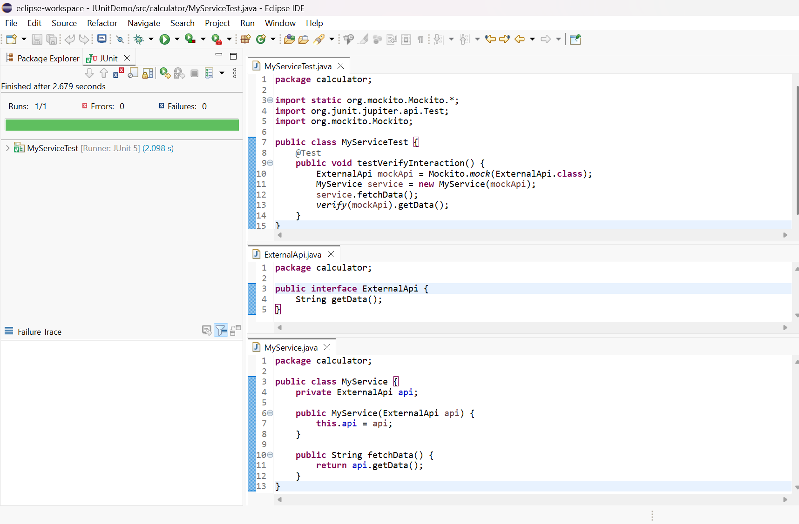

# Exercise 2: Verifying Interactions with Mockito

## Purpose
This exercise demonstrates how to use Mockito to verify that a method is called with specific arguments in a plain Java project using Eclipse.

## Step-by-Step Guide (Eclipse)

1. **Ensure Required JARs Are Added**
   - Add the following JARs to your project's build path:
     - mockito-core-5.2.0.jar
     - junit-jupiter-api-5.9.2.jar
     - junit-jupiter-engine-5.9.2.jar
     - opentest4j-1.2.0.jar
     - hamcrest-2.2.jar
     - byte-buddy-1.14.7.jar
     - byte-buddy-agent-1.14.7.jar
   - Right-click your project > Build Path > Configure Build Path > Libraries > Add External JARs...

2. **Create or Confirm the Following Classes in the `calculator` Package:**

**ExternalApi.java**
```java
package calculator;

public interface ExternalApi {
    String getData();
}
```

**MyService.java**
```java
package calculator;

public class MyService {
    private ExternalApi api;

    public MyService(ExternalApi api) {
        this.api = api;
    }

    public String fetchData() {
        return api.getData();
    }
}
```

3. **Create the Test Class**
- Right-click the `calculator` package > New > Class > Name: `MyServiceTest`
- Paste the following code:

```java
package calculator;

import static org.mockito.Mockito.*;
import org.junit.jupiter.api.Test;
import org.mockito.Mockito;

public class MyServiceTest {
    @Test
    public void testVerifyInteraction() {
        ExternalApi mockApi = Mockito.mock(ExternalApi.class);
        MyService service = new MyService(mockApi);
        service.fetchData();
        verify(mockApi).getData();
    }
}
```

4. **Run the Test**
- Right-click `MyServiceTest.java` > Run As > JUnit Test
- You should see a green bar if the test passes.

## Output Screenshot
Below is the screenshot of the successful JUnit test run (green bar indicates the verification worked as expected):



*Replace `output_screenshot.png` with your actual screenshot file.*

---

This confirms that Mockito can be used to verify method calls and interactions in a plain Java project in Eclipse. 