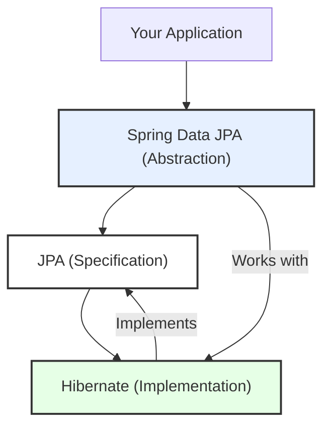

```mermaid
flowchart TD
    JPA["JPA (Specification)"]
    Hibernate["Hibernate (Implementation)"]
    SpringDataJPA["Spring Data JPA (Abstraction)"]
    App["Your Application"]

    App --> SpringDataJPA
    SpringDataJPA --> JPA
    JPA --> Hibernate
    Hibernate -->|Implements| JPA
    SpringDataJPA -->|Works with| Hibernate

    classDef spec fill:#fff,stroke:#333,stroke-width:2px;
    classDef impl fill:#e6ffe6,stroke:#333,stroke-width:2px;
    classDef abs fill:#e6f0ff,stroke:#333,stroke-width:2px;
    class JPA spec;
    class Hibernate impl;
    class SpringDataJPA abs;
``` 