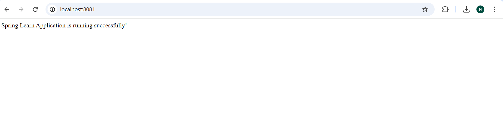
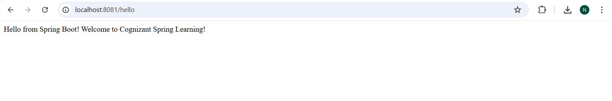

# Spring Learn Project

This is a Spring Boot Web application created for learning purposes at Cognizant.

## Project Structure

```
spring-learn/
├── src/
│   ├── main/
│   │   ├── java/
│   │   │   └── com/cognizant/springlearn/
│   │   │       ├── SpringLearnApplication.java
│   │   │       └── controller/
│   │   │           └── HelloController.java
│   │   └── resources/
│   │       └── application.properties
│   └── test/
│       └── java/
│           └── com/cognizant/springlearn/
│               └── SpringLearnApplicationTests.java
├── pom.xml
└── README.md
```

## Build Instructions

1. Navigate to the project directory
2. Run the Maven build command:
   ```bash
   mvn clean package -Dhttp.proxyHost=proxy.cognizant.com -Dhttp.proxyPort=6050 -Dhttps.proxyHost=proxy.cognizant.com -Dhttps.proxyPort=6050 -Dhttp.proxyUser=123456
   ```

## Running the Application

1. Run the `SpringLearnApplication` class
2. The application will start on `http://localhost:8080`
3. Test endpoints:
   - `http://localhost:8080/` - Home page
   - `http://localhost:8080/hello` - Hello message

## Dependencies

- Spring Boot Starter Web
- Spring Boot DevTools
- Spring Boot Starter Test 

## Example Output

### Home Page (`/`)
When you visit [http://localhost:8081/](http://localhost:8081/) in your browser, you will see:

```
Spring Learn Application is running successfully!
```

### Hello Endpoint (`/hello`)
When you visit [http://localhost:8081/hello](http://localhost:8081/hello) in your browser, you will see:

```
Hello from Spring Boot! Welcome to Cognizant Spring Learning!
```

---


- 
- 

